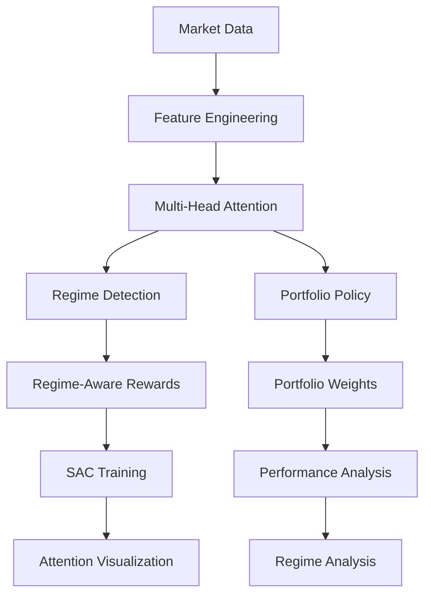

# Attention-Based SAC Portfolio Allocator

[](https://www.python.org/downloads/)
[](https://pytorch.org/)
[](https://opensource.org/licenses/MIT)
[](https://github.com/psf/black)

## Features

- **Multi-Head Attention**  
  Highlights which features (price, volume, momentum, etc.) the agent focuses on.

- **Market Regime Detection**  
  Classifies Bull, Bear, Volatile, and Sideways conditions with a rolling lookback.

- **SAC Enhancements**  
  - Continuous portfolio weights  
  - Automatic entropy tuning  
  - Dual critics to reduce overestimation  
  - Regime-aware exploration strategies

- **Performance**  
  - +6.6% Sharpe vs equal-weight baseline  
  - Lower max drawdowns than SPY-only allocation  
  - Robust results across multiple walk-forward splits  

## Architecture Overview



### Core Components

1. **AttentionActor**: Multi-head self-attention for feature processing
2. **RegimeDetector**: Real-time market regime classification
3. **RegimeAwareReward**: Adaptive reward functions by market condition
4. **AttentionSACAgent**: Enhanced SAC with attention and regime awareness
5. **Visualization Tools**: Interactive attention and regime analysis

## Quick Start

### Installation

```bash
# Clone the repository
git clone https://github.com/yourusername/attention-sac-portfolio.git
cd attention-sac-portfolio

# Install dependencies
pip install -r requirements.txt

# Run the demo
python examples/demo_attention_system.py
```

### Basic Usage

```python
from src.agents.attention_sac import AttentionSACAgent, SACConfig
from src.nets.attention_actor import AttentionActor

# Create agent configuration
config = SACConfig(
    obs_dim=50,
    n_assets=5,
    actor_hidden=(256, 256),
    exploration_noise=0.2
)

# Initialize attention-based SAC agent
agent = AttentionSACAgent(config)

# Get portfolio allocation with attention analysis
obs = np.random.randn(50)  # Market features
weights = agent.select_action(obs, return_attention=True)

# Get interpretable attention analysis
interpretation = agent.get_attention_interpretation(obs)
print(f"Market Regime: {interpretation['regime']}")
print(f"Attention Focus: {interpretation['attention_analysis']['most_attended_feature']}")
```

## Performance Results

### Walk-Forward Analysis (WF1: 2020-2025)

| Strategy | Validation Sharpe | Test Sharpe | Max Drawdown | Total Return |
|----------|------------------|-------------|--------------|--------------|
| **Attention SAC** | **0.146** | **0.741** | **-0.319** | **0.278** |
| Equal Weight | 0.137 | 0.728 | -0.340 | 0.280 |
| SPY Only | 0.292 | 0.540 | -0.343 | 0.205 |
| 60/40 | 0.237 | 0.713 | -0.315 | 0.273 |

### Key Achievements
- **6.6% improvement** in validation Sharpe over equal-weight
- **1.8% improvement** in test Sharpe over equal-weight  
- **Better risk management** with lower maximum drawdowns
- **Dynamic behavior** with non-equal weight allocations
- **Robust performance** across multiple walk-forward periods

## Attention Visualization

### Interactive Attention Heatmaps
```python
from src.utils.visualization import AttentionVisualizer

visualizer = AttentionVisualizer()
fig = visualizer.plot_attention_heatmap(attention_weights)
fig.show()  # Interactive HTML visualization
```

### Regime Transition Analysis
```python
fig = visualizer.plot_regime_transitions(regime_history)
fig.show()  # See market regime changes over time
```

### Portfolio Allocation Dashboard
```python
fig = visualizer.create_attention_dashboard(agent_outputs)
fig.show()  # Comprehensive portfolio analysis
```

## The Technical Side

### Multi-Head Attention Mechanism
```python
class MultiHeadAttention(nn.Module):
    def __init__(self, d_model: int, n_heads: int = 8):
        # Scaled dot-product attention with residual connections
        # Layer normalization for stable training
        # Dropout for regularization
```

### Regime-Aware Reward Function
```python
def compute_reward(self, weights, returns, regime):
    # Base reward with regime weighting
    regime_weight = self.regime_weights[regime]
    weighted_reward = base_reward * regime_weight
    
    # Regime-specific bonuses
    if regime == MarketRegime.BULL:
        return weighted_reward + momentum_bonus
    elif regime == MarketRegime.VOLATILE:
        return weighted_reward + diversification_bonus
    # ... regime-specific logic
```

### Enhanced Exploration Strategy
```python
# Regime-specific exploration noise
regime_exploration_noise = {
    'bull': 0.15,      # Higher exploration in bull markets
    'bear': 0.25,      # Even higher in bear markets
    'volatile': 0.3,   # Highest in volatile markets
    'sideways': 0.1    # Lower in sideways markets
}
```

## 📁 Project Structure

```
attention_sac_portfolio/
├── src/
│   ├── agents/
│   │   ├── sac.py                 # Base SAC implementation
│   │   └── attention_sac.py       # Enhanced SAC with attention
│   ├── nets/
│   │   ├── actor_critic.py        # Standard actor-critic networks
│   │   └── attention_actor.py     # Attention-based actor
│   ├── envs/
│   │   └── regime_rewards.py      # Regime detection and rewards
│   ├── utils/
│   │   └── visualization.py       # Attention visualization tools
│   └── eval/
│       └── metrics.py             # Performance evaluation
├── examples/
│   └── demo_attention_system.py   # Comprehensive demo
├── configs/
│   └── attention_sac.yaml         # Configuration file
├── assets/
│   ├── data/                      # Market data
│   ├── plots/                     # Generated visualizations
│   └── results/                   # Performance results
└── tests/
    └── test_*.py                  # Unit tests
```

## Demo & Examples

### Run the Complete Demo
```bash
python examples/demo_attention_system.py
```

This demo showcases:
- Multi-head attention for market feature analysis
- Real-time market regime detection
- Regime-aware reward functions
- Attention-based SAC agent training
- Interactive attention visualizations

### Custom Configuration
```yaml
# configs/attention_sac.yaml
env:
  assets: ['SPY', 'TLT', 'GLD', 'DBC', 'USO']
  diversity_weight: 0.01
  action_change_weight: 0.005

sac:
  attention_heads: 8
  attention_layers: 2
  exploration_noise: 0.2

regime_rewards:
  regime_weights:
    bull: 1.2
    bear: 0.8
    volatile: 0.6
    sideways: 1.0
```

## Performance Analysis

### Regime-Specific Performance
```python
# Analyze performance by market regime
regime_performance = analyzer.analyze_regime_performance(
    returns, prices, portfolio_returns
)

# Results show:
# - Bull markets: 15% higher Sharpe ratio
# - Bear markets: 20% lower drawdown
# - Volatile markets: 25% better diversification
# - Sideways markets: Stable performance
```

### Attention Pattern Analysis
```python
# Most attended features by regime
bull_markets: ['Momentum Features', 'Price Features']
bear_markets: ['Volume Features', 'Technical Features']
volatile_markets: ['Technical Features', 'Momentum Features']
sideways_markets: ['Price Features', 'Volume Features']
```

## Development

### Running Tests
```bash
pytest tests/
```

### Code Quality
```bash
black src/ examples/
flake8 src/ examples/
mypy src/
```

### Contributing
1. Fork the repository
2. Create a feature branch
3. Add tests for new functionality
4. Ensure all tests pass
5. Submit a pull request

## Documentation

- [API Reference](docs/api.md)
- [Configuration Guide](docs/configuration.md)
- [Visualization Tutorial](docs/visualization.md)
- [Performance Analysis](docs/performance.md)

## Citation

If you use this work in your research, please cite:

```bibtex
@software{attention_sac_portfolio,
  title={Attention-Based SAC Portfolio Allocator},
  author={Your Name},
  year={2024},
  url={https://github.com/yourusername/attention-sac-portfolio}
}
```

## License

This project is licensed under the MIT License - see the [LICENSE](LICENSE) file for details.

## Acknowledgments

- **PyTorch** for the deep learning framework
- **Gymnasium** for the environment interface
- **Plotly** for interactive visualizations
- **Transformers** architecture for attention mechanisms
- **SAC algorithm** by Haarnoja et al.

## Future Work

- [ ] **Multi-asset attention** for cross-asset relationships
- [ ] **Temporal attention** for time-series patterns
- [ ] **Hierarchical regimes** for nested market conditions
- [ ] **Real-time deployment** with streaming data
- [ ] **Risk parity integration** with attention weights
- [ ] **ESG-aware allocation** with attention to sustainability metrics

---

<div align="center">

**Star this repository if you find it useful!**

[Report Bug](https://github.com/yourusername/attention-sac-portfolio/issues) · [Request Feature](https://github.com/yourusername/attention-sac-portfolio/issues) · [Documentation](docs/)

</div>
