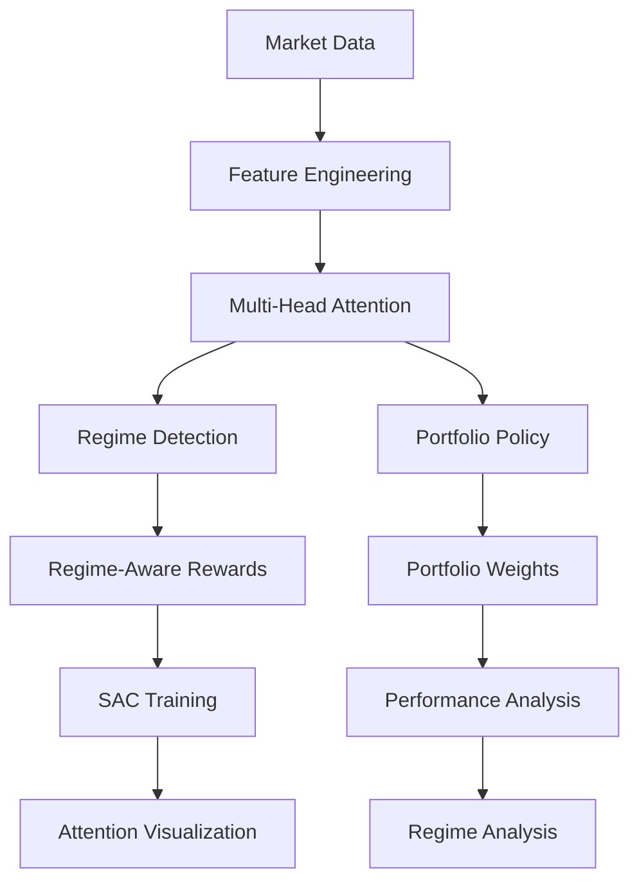

# Architecture Documentation

This document provides a detailed overview of the Attention-Based SAC Portfolio Allocator architecture.

## System Overview

The Attention-Based SAC Portfolio Allocator is a sophisticated reinforcement learning system that combines:

1. **Multi-Head Attention** for interpretable market feature analysis
2. **Market Regime Detection** for adaptive strategy selection
3. **Soft Actor-Critic (SAC)** for continuous portfolio optimization
4. **Regime-Aware Rewards** for market-condition-specific learning

## High-Level Architecture



## Component Architecture

### 1. Attention-Based Actor Network

#### Architecture Overview
```
Input Features (50D) 
    ↓
Feature Embedding (256D)
    ↓
Feature Grouping (4 groups × 256D)
    ↓
Multi-Head Attention (8 heads × 2 layers)
    ↓
Global Average Pooling (256D)
    ↓
┌─────────────────┬─────────────────┐
│ Regime Classifier │ Regime Policies │
│ (4 classes)      │ (4 policies)    │
└─────────────────┴─────────────────┘
    ↓
Weighted Combination + Global Policy
    ↓
Portfolio Weights (5D)
```

#### Key Components

**Feature Embedding Layer**
- Input: 50-dimensional market features
- Output: 256-dimensional embedded features
- Architecture: Linear → ReLU → Dropout → Linear

**Feature Grouping**
- Groups related features into 4 categories:
  - Price Features
  - Volume Features  
  - Technical Features
  - Momentum Features
- Each group padded to 256 dimensions for attention

**Multi-Head Attention**
- 8 attention heads
- 2 attention layers
- Scaled dot-product attention
- Residual connections and layer normalization
- Dropout for regularization

**Regime Classification**
- 4-class classifier (Bull, Bear, Volatile, Sideways)
- Architecture: Linear → ReLU → Dropout → Linear → ReLU → Dropout → Linear
- Output: Regime probabilities and predictions

**Regime-Aware Policies**
- 4 separate policy networks (one per regime)
- Architecture: Linear → ReLU → Dropout → Linear
- Output: Regime-specific portfolio logits

**Global Policy**
- Fallback policy for robustness
- Architecture: Linear → ReLU → Dropout → Linear
- Output: Global portfolio logits

**Weight Combination**
- Weighted combination of regime-specific policies
- 80% regime policies + 20% global policy
- Temperature scaling for exploration control
- Softmax normalization for valid portfolio weights

### 2. Market Regime Detection

#### Regime Classification Logic

```python
def detect_regime(returns, prices):
    volatility = std(returns)
    trend_strength = calculate_trend_strength(prices)
    momentum = calculate_momentum(returns)
    
    if volatility > volatility_threshold:
        return VOLATILE
    elif trend_strength > trend_threshold:
        if momentum > 0:
            return BULL
        else:
            return BEAR
    else:
        return SIDEWAYS
```

#### Regime Indicators

**Volatility Threshold (2%)**
- High volatility → Volatile regime
- Encourages diversification

**Trend Strength Threshold (5%)**
- Strong trends → Bull/Bear regime
- Encourages momentum strategies

**Momentum Threshold (10%)**
- Positive momentum → Bull regime
- Negative momentum → Bear regime

### 3. Regime-Aware Reward Function

#### Reward Components

**Base Reward**
- Portfolio return after transaction costs
- Regime-weighted for market conditions

**Regime-Specific Bonuses**
- **Bull Market**: Momentum bonus for growth
- **Bear Market**: Defensive positioning bonus
- **Volatile Market**: Diversification bonus
- **Sideways Market**: Neutral weighting

**Universal Components**
- **Diversification Bonus**: Herfindahl index-based
- **Action Change Bonus**: Encourages rebalancing
- **Momentum Bonus**: Trend-following rewards
- **Volatility Penalty**: Risk management

#### Regime Weights
```python
regime_weights = {
    MarketRegime.BULL: 1.2,      # Favor momentum
    MarketRegime.BEAR: 0.8,      # Reduce risk
    MarketRegime.VOLATILE: 0.6,  # Favor diversification
    MarketRegime.SIDEWAYS: 1.0   # Neutral
}
```

### 4. Enhanced SAC Agent

#### SAC Modifications

**Attention-Based Actor**
- Replaces standard MLP actor
- Provides interpretable attention weights
- Regime-aware policy generation

**Regime-Specific Exploration**
```python
regime_exploration_noise = {
    'bull': 0.15,      # Moderate exploration
    'bear': 0.25,      # Higher exploration
    'volatile': 0.3,   # Highest exploration
    'sideways': 0.1    # Lower exploration
}
```

**Enhanced Loss Functions**
- Standard SAC losses (actor, critic, alpha)
- Attention regularization for diversity
- Regime consistency loss for stability

#### Training Process

1. **Experience Collection**
   - Collect (state, action, reward, next_state, done)
   - Store in replay buffer

2. **Critic Update**
   - Standard SAC critic loss
   - Twin Q-networks for stability

3. **Actor Update**
   - SAC actor loss with entropy bonus
   - Attention regularization
   - Regime consistency loss

4. **Alpha Update**
   - Automatic temperature tuning
   - Target entropy: -log(n_assets)

5. **Target Update**
   - Soft update of target networks
   - Tau = 0.005

### 5. Visualization System

#### Attention Visualization

**Attention Heatmaps**
- Show attention patterns between feature groups
- Interactive Plotly visualizations
- Layer and head selection

**Attention Evolution**
- Time series of attention patterns
- Shows how focus changes over time
- Identifies regime transitions

**Feature Importance**
- Average attention to each feature group
- Bar charts and pie charts
- Statistical analysis

#### Regime Visualization

**Regime Transitions**
- Timeline of market regimes
- Transition frequency analysis
- Regime duration statistics

**Regime Performance**
- Performance metrics by regime
- Sharpe ratio, drawdown, win rate
- Comparative analysis

#### Portfolio Visualization

**Weight Evolution**
- Time series of portfolio weights
- Asset allocation changes
- Correlation with market regimes

**Performance Dashboard**
- Comprehensive performance metrics
- Comparison with baselines
- Risk-return analysis

## Data Flow

### Training Phase

```
Market Data → Feature Engineering → Attention Actor → Regime Detection
     ↓
Portfolio Weights → Environment → Regime-Aware Rewards → SAC Update
     ↓
Attention Weights → Visualization → Performance Analysis
```

### Inference Phase

```
Market Data → Feature Engineering → Attention Actor → Regime Detection
     ↓
Portfolio Weights → Performance Tracking → Attention Analysis
```

## Memory and Computational Complexity

### Attention Complexity
- **Time Complexity**: O(n²d) where n=sequence_length, d=model_dim
- **Space Complexity**: O(n²) for attention weights
- **Sequence Length**: 4 (feature groups)
- **Model Dimension**: 256

### Regime Detection Complexity
- **Time Complexity**: O(k) where k=lookback_window
- **Lookback Window**: 20 periods
- **Update Frequency**: Every step

### SAC Complexity
- **Actor Update**: O(batch_size × hidden_dim²)
- **Critic Update**: O(batch_size × hidden_dim²)
- **Batch Size**: 256
- **Hidden Dimension**: 256

## Scalability Considerations

### Horizontal Scaling
- **Data Parallelism**: Multiple workers for data loading
- **Model Parallelism**: Attention heads across devices
- **Distributed Training**: Multi-GPU support

### Vertical Scaling
- **Memory Optimization**: Gradient checkpointing
- **Computation Optimization**: Mixed precision training
- **Batch Size Scaling**: Dynamic batch sizing

## Security and Robustness

### Input Validation
- **Shape Checking**: All tensor operations validated
- **Type Checking**: Strict type hints enforced
- **Range Checking**: Portfolio weights normalized

### Error Handling
- **Graceful Degradation**: Fallback to global policy
- **Exception Handling**: Comprehensive error catching
- **Logging**: Detailed error logging

### Reproducibility
- **Random Seeds**: Fixed seeds for reproducibility
- **Deterministic Operations**: CUDA deterministic mode
- **Version Control**: Pinned dependencies

## Performance Optimization

### Training Optimization
- **Gradient Clipping**: Prevents exploding gradients
- **Learning Rate Scheduling**: Adaptive learning rates
- **Early Stopping**: Validation-based stopping

### Inference Optimization
- **Model Quantization**: Reduced precision inference
- **Caching**: Attention weight caching
- **Batch Processing**: Efficient batch inference

## Monitoring and Observability

### Training Metrics
- **Loss Tracking**: Actor, critic, alpha losses
- **Attention Metrics**: Entropy, diversity, focus
- **Regime Metrics**: Distribution, transitions, confidence

### Performance Metrics
- **Portfolio Metrics**: Sharpe, drawdown, returns
- **Regime Metrics**: Performance by regime
- **Attention Metrics**: Feature importance, evolution

### Visualization
- **Real-time Dashboards**: Training progress
- **Interactive Plots**: Attention and regime analysis
- **Performance Reports**: Comprehensive analysis

## Future Architecture Enhancements

### Planned Improvements
1. **Hierarchical Attention**: Multi-scale attention
2. **Temporal Attention**: Time-series attention
3. **Cross-Asset Attention**: Asset relationship modeling
4. **Dynamic Regime Detection**: Adaptive thresholds
5. **Multi-Objective Optimization**: Risk-return trade-offs

### Research Directions
1. **Transformer Architecture**: Full transformer implementation
2. **Graph Neural Networks**: Asset relationship graphs
3. **Meta-Learning**: Few-shot regime adaptation
4. **Causal Inference**: Causal attention mechanisms
5. **Uncertainty Quantification**: Bayesian attention weights
